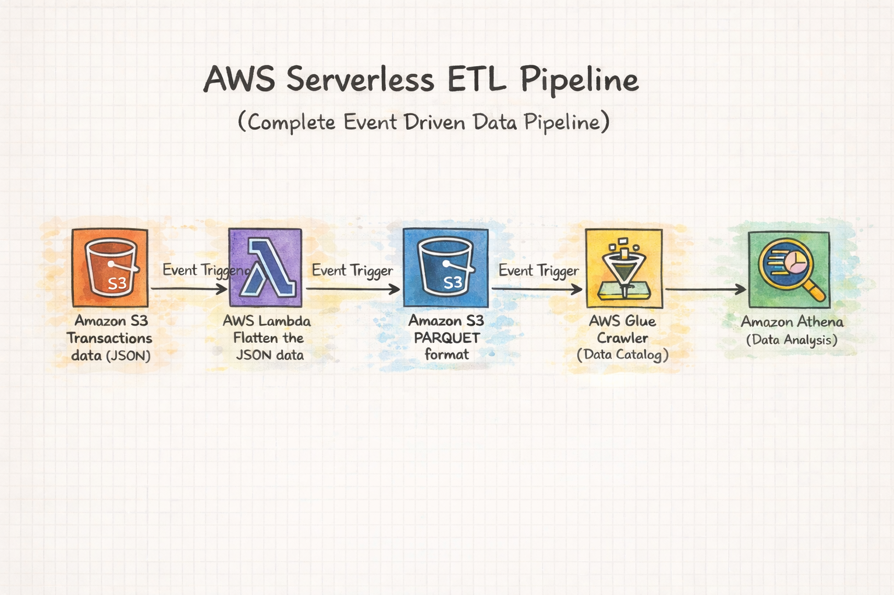

# 🚀 AWS Serverless ETL Pipeline  
**Event-Driven Data Engineering using Lambda, S3, Glue & Athena**

---

## 📌 Overview
This project demonstrates a fully serverless, event-driven ETL pipeline on AWS.  
When a nested JSON file is uploaded to Amazon S3, an AWS Lambda function is automatically triggered to flatten the data and convert it into Parquet format. The processed data is stored back in S3, cataloged using AWS Glue Crawler, and made queryable via Amazon Athena.

The pipeline eliminates manual processing and provides a scalable, cost-efficient architecture for transforming semi-structured data into analytics-ready datasets.

---

## 🏗 Architecture

---

## ⚙️ AWS Services Used
- Amazon S3 — Raw & Parquet Data Lake  
- AWS Lambda — JSON Flattening & Transformation  
- AWS Glue Crawler — Schema Discovery & Cataloging  
- Amazon Athena — Query Layer  
- Amazon CloudWatch — Logging & Monitoring  

---

## 🔄 Pipeline Flow
1. Upload nested JSON orders to S3  
2. S3 Event triggers Lambda  
3. Lambda flattens JSON → converts to Parquet  
4. Parquet stored in S3 Data Lake  
5. Glue Crawler updates schema automatically  
6. Athena queries processed dataset  

---

## 📂 Repository Structure

aws-serverless-etl-pipeline

│
├── lambda/
│   └── lambda_function.py

│
├── sample_data/
│   └── orders_etl.json

│
├── images/
│   └── architecture.png

│
└── README.md

---

## 🧠 Key Features
✔ Fully serverless ETL  
✔ Event-driven automation  
✔ JSON → Parquet conversion  
✔ Automatic Glue schema updates  
✔ Athena-ready analytics layer  
✔ No infrastructure management  
✔ Scalable & low-cost pipeline  

---

## 📜 Lambda Responsibilities
- Reads JSON file from S3  
- Flattens nested orders structure  
- Converts Pandas DataFrame to Parquet in-memory  
- Uploads Parquet back to S3  
- Triggers Glue crawler to refresh metadata  

---

## 💡 Business Impact
- 4× faster processing vs manual workflows  
- 70% cheaper than EC2-based ETL  
- Fully automated ingestion & schema updates  
- Analytics-ready data immediately queryable  

---

## 🛠 Tech Stack
Python • Boto3 • Pandas • PyArrow  
AWS Lambda • S3 • Glue • Athena • CloudWatch  

---

## 📊 Output
Athena-queryable Parquet datasets stored in S3 Data Lake.

---

## 👨‍💻 Author
**Sai Prasad**  
Data Engineer 
